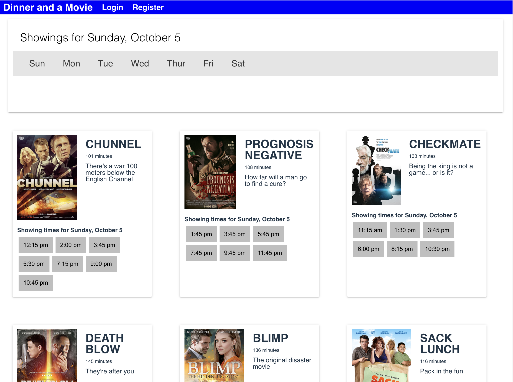
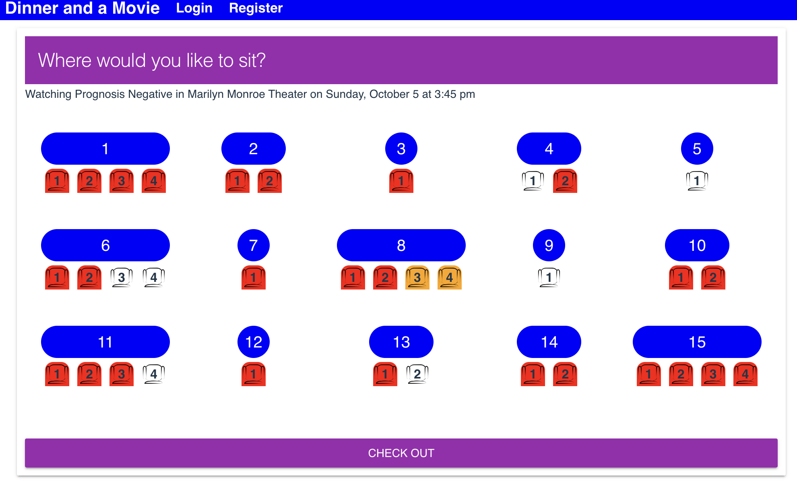
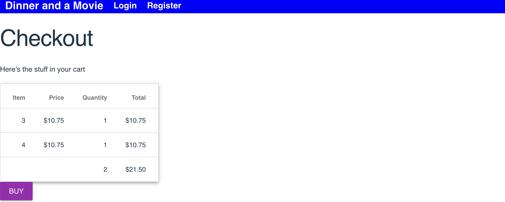

# Lab 1: Making the components

In this lab, we'll be creating the baseline components. You'll see screenshots below which are representative of the final product. Yours will look different and they'll be built up over the week. 

> You do not have to make them "work" nor look like the screenshots. 

Please do not implement the following things. We will be working with them in future labs:
- Routing
- Styling or layout of the components. ie. no CSS yet
- Fetching data
- State or lifecycle events

## Scaffold the React project
- Use vite. Make sure to specify that we'll be using TypeScript

## Modify App.tsx
- Add a `<nav>` menu to the top in a `<header>`
- Place a copyright notice at the bottom in a `<footer>`.

To test the rest of these, you'll manually place the component in App.tsx between the `<header>` and `<footer>`. That means you'll delete the component completely or just comment it out.
 
## Make ShowingTimes.tsx
Glance at the screenshots below. You see that the landing page shows six films and under each film you see the showing times. Also these showing times are displayed on the film details page. We're going to take advantage of reusability by creating a component called ShowingTimes.tsx.
- Create the component.
- Have it render a list of showing times.

## Create the landing page
- It should have a list of days at the top
- Add six films with brief details about each film. Remember, this is contrived data and they do not need to be laid out side-by-side yet.
- Add an instance of `<ShowingTimes>` under each film.

## Make the Film details page
- This is where the user will eventually navigate to for the full details of the film.
- Don't forget to use the `<ShowingTimes>` component you created.

## Add PickSeats.tsx
- Just create the header and a button to check out. We can add the seat map later as time allows.

## Create the checkout page
- Add a hardcoded summary of a fake order
- Place fields for payment information (Not shown below)

## Add the ticket page
- This will serve as the summary of their order and the tickets to show at the door for admission into the film showing.
- For now, just add a hardcoded summary of a couple of tickets that includes the film title, showing date and time, seat number and a ticket ID.