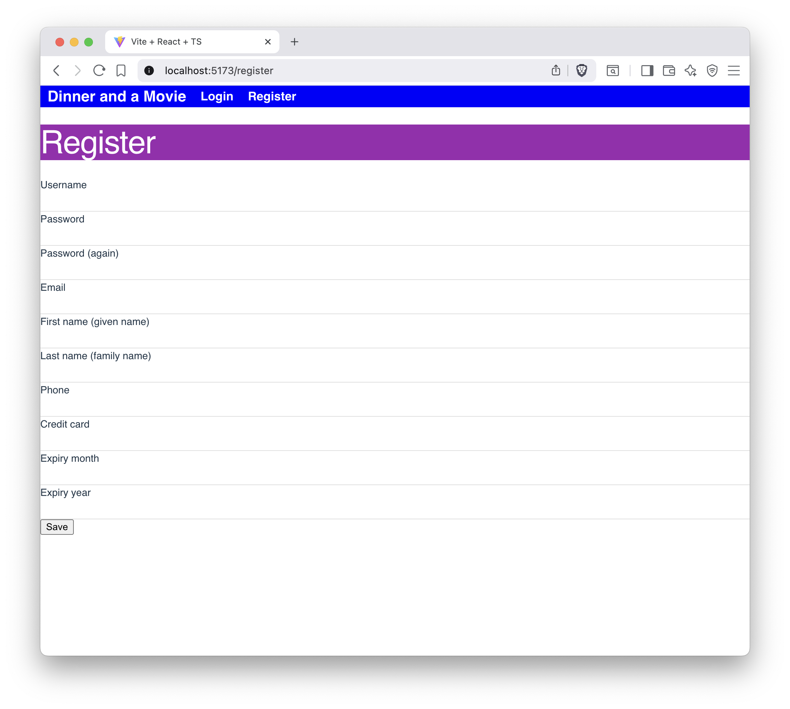

# Lab 5: Modern async fetching

In this lab we'll be modernizing our data fetching using `use` and TanStack Query. This will simplify our components and make them more robust.

## Using `use` for data fetching
- Refactor the data fetching in the LandingPage component to use `use` instead of `useEffect` and `useState`.

Note: The server has the ability to delay responses by going `node apiServer --delay 2000`. You can use this to see your loading states.

## Using TanStack Query to fetch booked seats
We're going to work with PickSeats for this part. It is currently not drawing up the seat map and it is not fetching the booked seats. In this lab you'll fetch but not necessarily display the booked seats in rows and columns. Just log them to the console for now or display the JSON in a `<pre>` tag.

- Install TanStack Query using npm.
- Update PickSeats to use TanStack Query for data fetching.
- Make sure to handle loading and error states appropriately using TanStack Query's built-in mechanisms.

## The Register component
- Create a new component called Register.tsx.
- This component should allow a user to register for an account by providing a username, email, password, ... all the things.
- Use TanStack Query to handle the registration process, including sending the data to the server and handling the response. You can measure success by seeing the new user in the database or examing the network tab in your browser's developer tools.
- Make sure to handle loading and error states appropriately.
