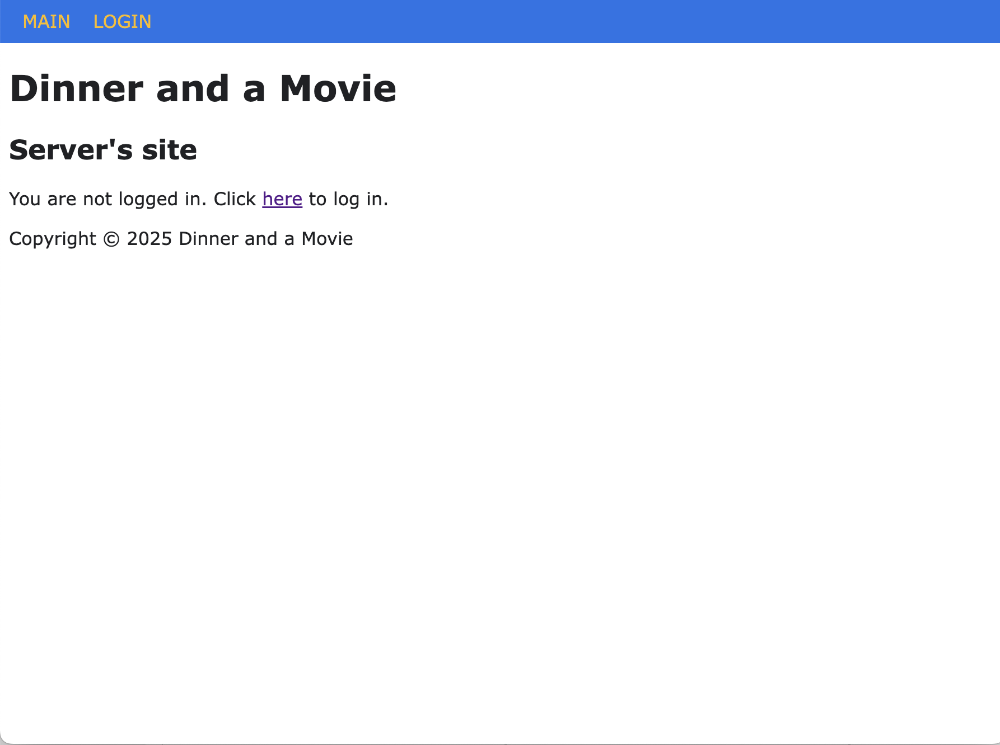
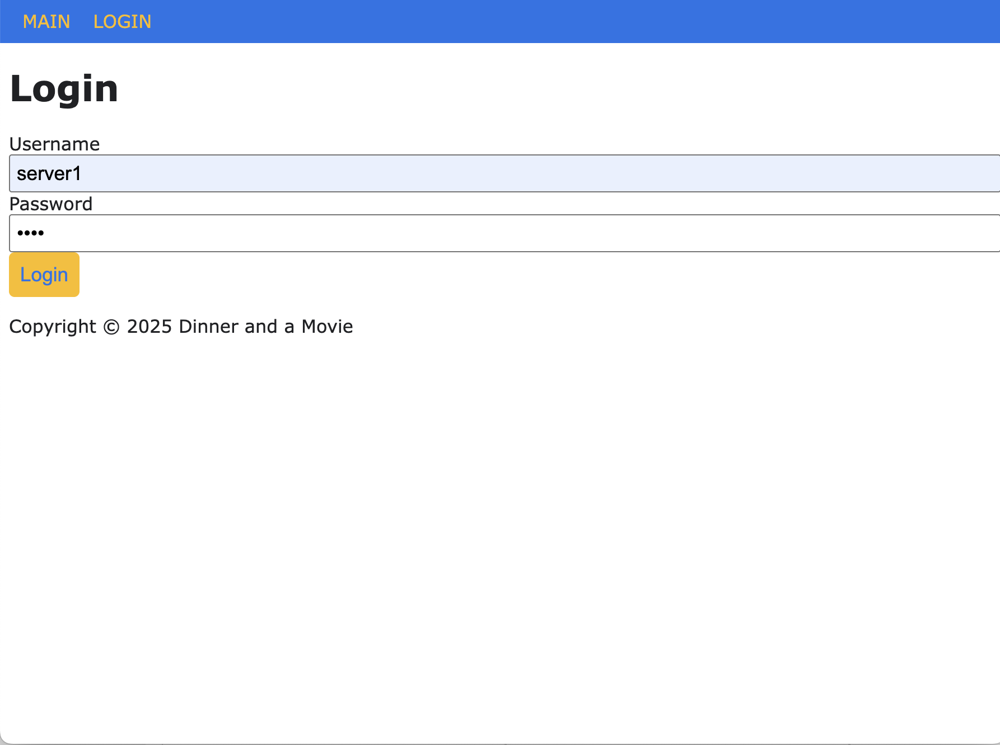
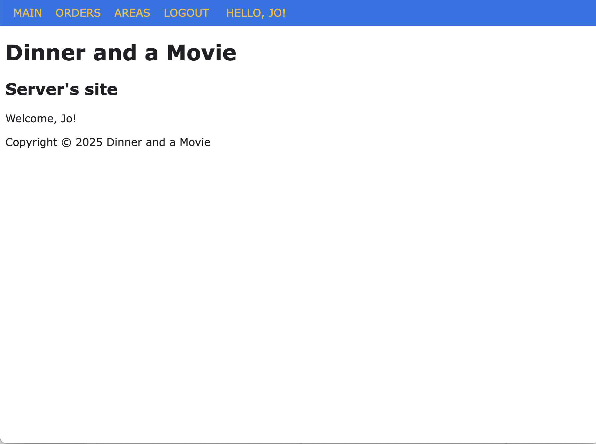
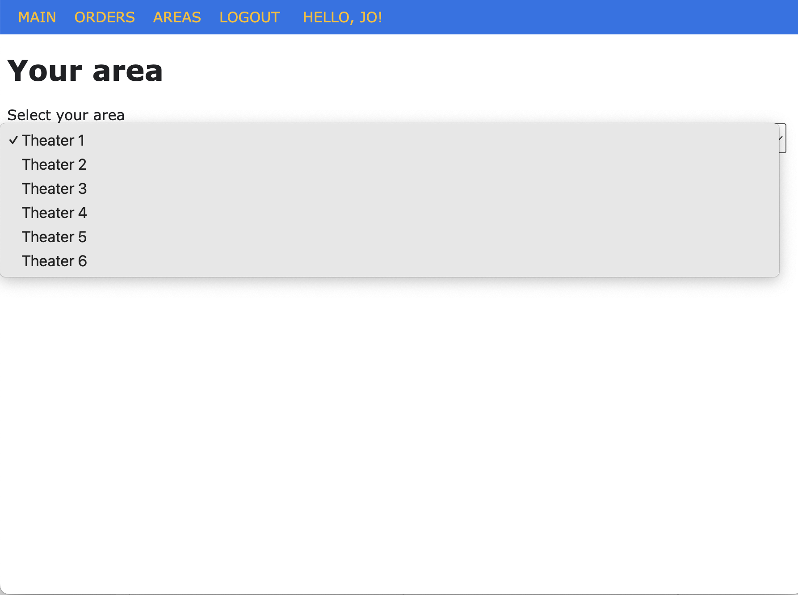
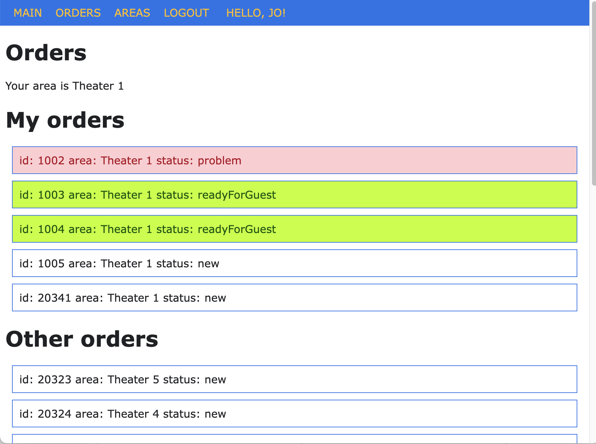
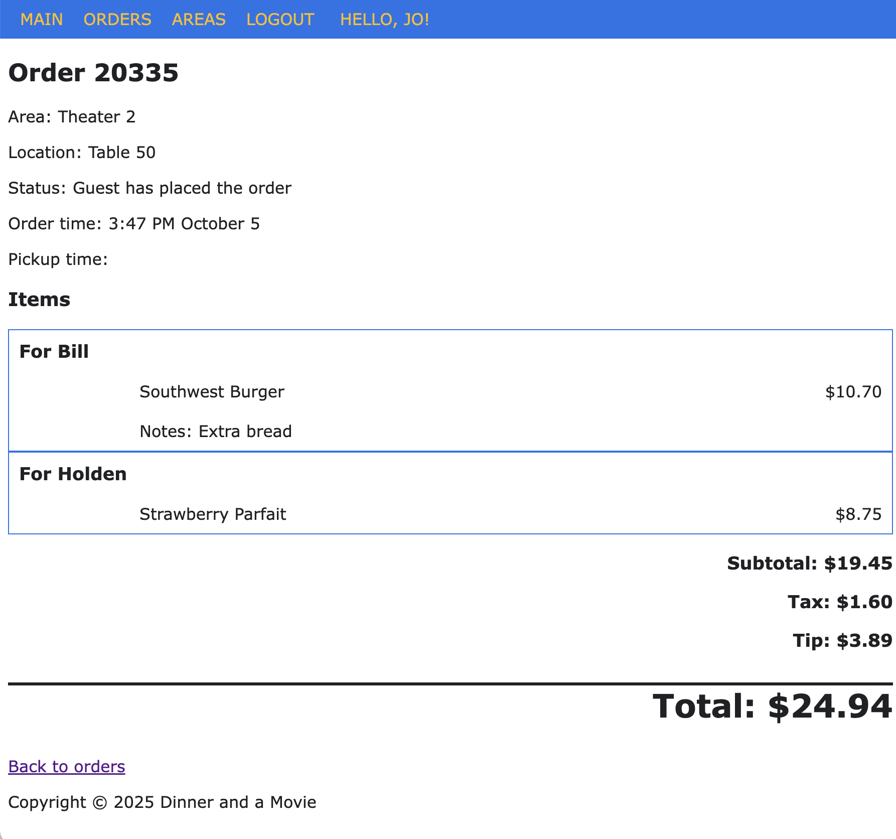
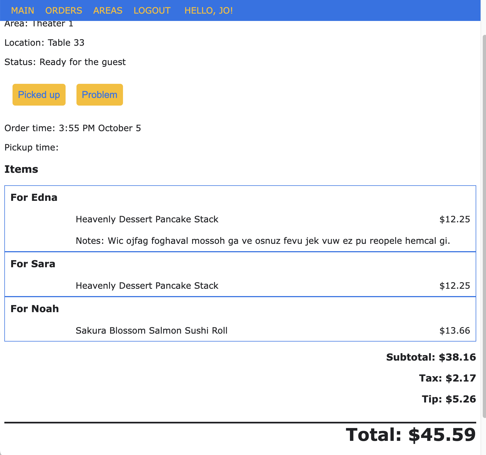
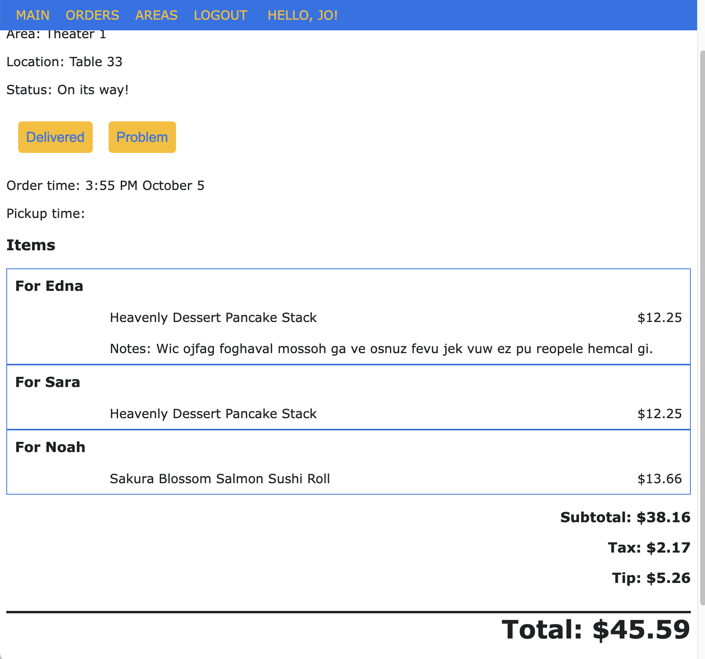
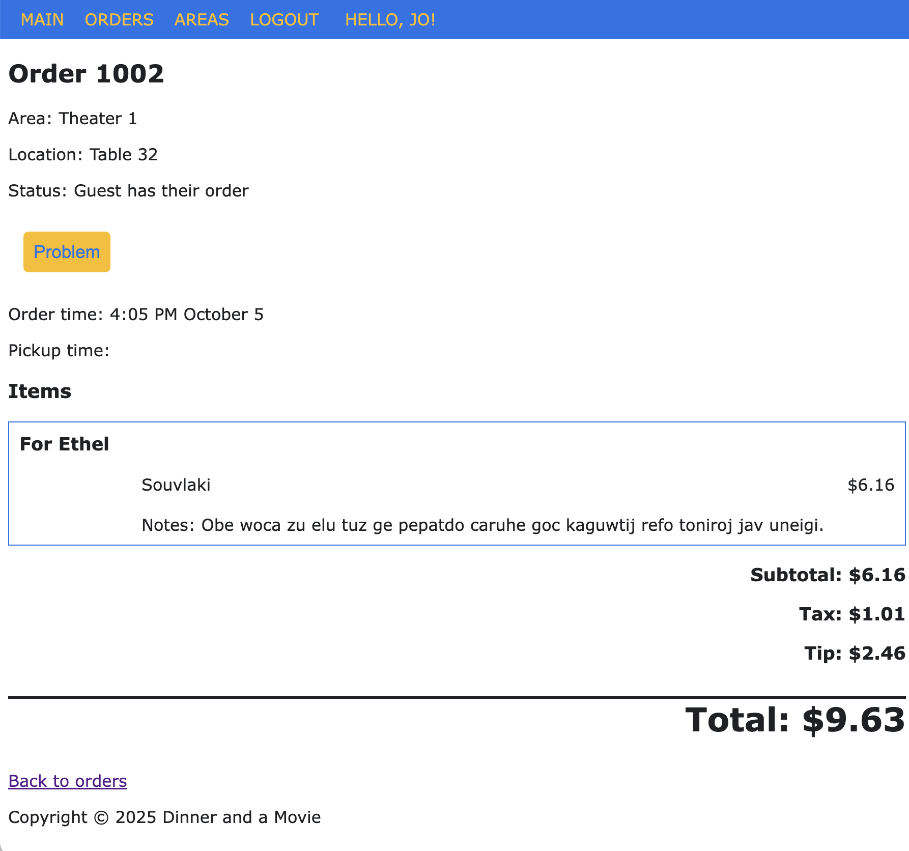
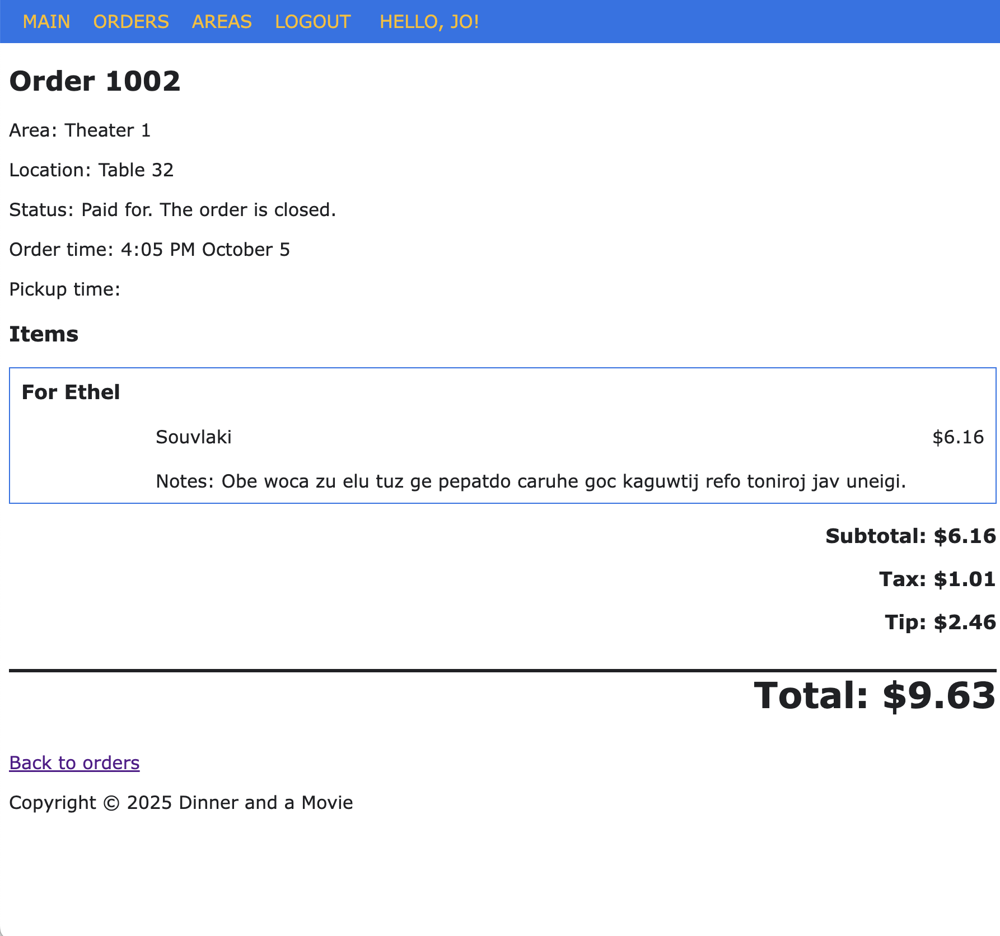

# Capstone Project

You've created the customer-facing app where films can be chosen, seats reserved, and orders placed. Now let's create the back-of-house app for our wait staff.

When a waiter connects to the site on their tablet, they'll see the unauthenticated home page.

The log in page is typical:

Logging in as a waiter will take them to the home page but now they're authenticated.

Waiters need to self-select their area, which is usually a theater.

The orders page shows all orders. The orders for their area are at the top but they're all shown in case this waiter has a free minute and wants to lend a hand.

## Order Statuses
Orders can be in one of several statuses.

| Status | Description |
|--------|-----|
|new|Placed but not yet prepared|
|readyForGuest|Ready for the guest to pick up|
|pickedUp|Picked up by the waiter. Being delivered to the table|
|delivered|Delivered to the table|
|complete|Order completed|
|problem|Order has an issue|

Choosing any order shows the details. The order page is the same for all statuses except for the action buttons shown.

## A new order:

## A readyForGuest order:

## A pickedUp order:

## A delivered order:

## A complete order:

